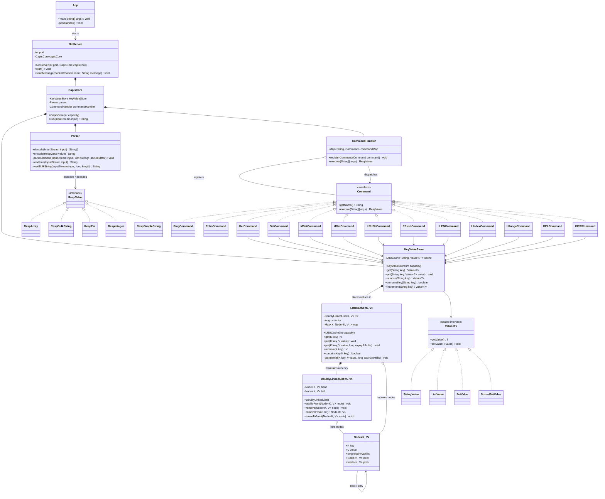

# CAPIS

CAPIS is a small Redis-like in-memory key-value server written in Java. It accepts a subset of Redis Serialization Protocol (RESP) commands over TCP and listens on the default Redis port, `6379`.

## Features

- `PING` returns `PONG`.
- `ECHO <message>` returns the supplied message.
- `SET <key> <value>` stores a value.
- `GET <key>` retrieves a value or returns a null response when the key is missing.
- In-memory LRU storage with a capacity of 100 entries.
- Stored entries expire after 24 hours by default.

This is an educational Redis-like server, not a complete Redis replacement. Data is held in memory and is lost when the process stops.

## Requirements

- Java 26.
- A Unix-like shell for the `./gradlew` commands below. On Windows, use `gradlew.bat` instead.

The Gradle wrapper can resolve the configured Java toolchain when needed.

## Build and test

Run these commands from the repository root:

```sh
./gradlew build
./gradlew test
```

## Run the server

```sh
./gradlew run
```

The server starts on TCP port `6379` and continues running until it is stopped with `Ctrl+C`.

If `redis-cli` is installed, connect to the server in another terminal:

```sh
redis-cli -p 6379 ping
redis-cli -p 6379 set greeting hello
redis-cli -p 6379 get greeting
```

## Project structure

```text
app/src/main/java/com/capis/Server.java              Server entry point
app/src/main/java/com/capis/entities/               RESP parsing and storage classes
gradle/wrapper/                                      Gradle wrapper files
```

## Class diagram



Generated Gradle output, compiled classes, IDE metadata, logs, and local environment files are excluded by `.gitignore`.