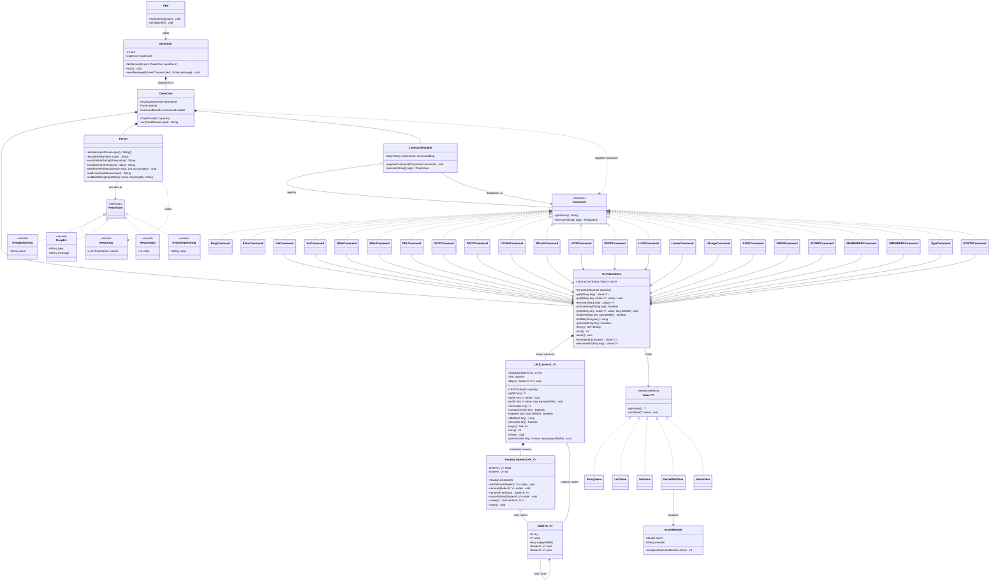

# CAPIS

CAPIS is a small Redis-like in-memory key-value server written in Java. It speaks a subset of the
Redis Serialization Protocol (RESP) over TCP and listens on the default Redis port, `6379`.

It is a from-scratch learning project: no embedded Redis, no Netty, no Lettuce. The storage engine is a
hand-rolled LRU cache backed by a doubly linked list, and the server is a single-threaded
non-blocking I/O loop built on `java.nio`.

## Features

- RESP request decoding and response encoding (`Parser`).
- A pluggable command registry: each command is a `Command` implementation dispatched by name.
- Three data types: strings, lists, and sets.
- In-memory LRU storage with a capacity of 1000 entries.
- Stored entries expire lazily after 24 hours.
- Single-threaded, non-blocking NIO server with no per-connection threads.
- `WRONGTYPE` errors when a command is applied to the wrong data type.

This is an educational Redis-like server, not a Redis replacement. There is no persistence, no
replication, no authentication, and no clustering. All data lives in memory and is lost when the
process stops.

## Requirements

- Java 26 (records, sealed interfaces, and pattern matching for `instanceof` are all used).
- A Unix-like shell for the `./gradlew` commands below. On Windows, use `gradlew.bat` instead.

The Gradle wrapper uses Gradle 9.7.1 with the Foojay toolchain resolver, so a suitable JDK is
downloaded automatically if the one on your `PATH` does not match.

## Build and test

Run these commands from the repository root:

```sh
./gradlew build
./gradlew test
```

There is currently no test source set, so `./gradlew test` reports `NO-SOURCE`.

## Run the server

```sh
./gradlew run
```

The server prints a banner and then blocks on the event loop until it is stopped with `Ctrl+C`. It
must be able to bind TCP port `6379`, so stop any other Redis or CAPIS instance first.

If `redis-cli` is installed, connect in another terminal:

```sh
redis-cli -p 6379 ping
redis-cli -p 6379 set greeting hello
redis-cli -p 6379 get greeting
```

## Supported commands

Command names are matched case-insensitively.

### Connection

| Command | Behaviour |
| --- | --- |
| `PING` | Returns `PONG`. `PING <message>` echoes the message as a bulk string. |
| `ECHO <message>` | Returns the supplied message as a bulk string. |

### Strings and keys

| Command | Behaviour |
| --- | --- |
| `SET <key> <value>` | Stores a string and returns `OK`. |
| `GET <key>` | Returns the string, a null bulk string if the key is missing, or `WRONGTYPE`. |
| `MSET <k> <v> [<k> <v> ...]` | Stores several string pairs and returns `OK`. |
| `MGET <key> [<key> ...]` | Returns an array, with a null element for missing or non-string keys. |
| `INCR <key>` | Increments a string holding an integer and returns the new value. Errors if the key is missing or not an integer. |
| `DECR <key>` | Decrements a string holding an integer and returns the new value. Errors if the key is missing or not an integer. |
| `DEL <key> [<key> ...]` | Removes keys and returns how many were deleted. |

### Lists

| Command | Behaviour |
| --- | --- |
| `LPUSH <key> <element> [<element> ...]` | Prepends elements and returns the new length. |
| `RPUSH <key> <element> [<element> ...]` | Appends elements and returns the new length. |
| `LPOP <key> [<count>]` | Pops from the head. Returns a bulk string, or an array when `count` is given. |
| `RPOP <key> [<count>]` | Pops from the tail. Returns a bulk string, or an array when `count` is given. |
| `LLEN <key>` | Returns the length, or `0` if the key is missing. |
| `LINDEX <key> <index>` | Returns the element at `index`. Negative indexes count from the tail. |
| `LRANGE <key> <start> <stop>` | Returns the inclusive range, clamped to the list bounds. |

### Sets

| Command | Behaviour |
| --- | --- |
| `SADD <key> <member> [<member> ...]` | Adds members and returns the resulting set size. |
| `SREM <key> <member> [<member> ...]` | Removes members and returns how many were removed. |
| `SCARD <key>` | Returns the cardinality, or `0` if the key is missing. |
| `SISMEMBER <key> <member>` | Returns `1` or `0`. |
| `SMEMBERS <key>` | Returns all members as an array. |

### Example session

```sh
redis-cli -p 6379 mset user:1 alice user:2 bob
redis-cli -p 6379 incr user:1

redis-cli -p 6379 rpush queue first second third
redis-cli -p 6379 lrange queue 0 -1
redis-cli -p 6379 lpop queue 2

redis-cli -p 6379 sadd tags redis java redis
redis-cli -p 6379 sismember tags java
```

## Request lifecycle

1. `NioServer` accepts a client and registers it with a `Selector` for read readiness.
2. On a readable event it reads into a `ByteBuffer` and wraps it in a small `InputStream` adapter.
3. `CapisCore.run` asks `Parser.decode` to turn the bytes into a `String[]`.
4. `CommandHandler.execute` looks the first argument up in its registry and dispatches.
5. The command's `RespValue` is turned back into bytes by `Parser.encode` and written to the channel.

## Project structure

```text
app/src/main/java/com/capis/App.java                       Entry point, prints the banner
app/src/main/java/com/capis/NioServer.java                 Non-blocking TCP server and event loop
app/src/main/java/com/capis/CapisCore.java                 Wires the store, parser, and commands
app/src/main/java/com/capis/Parser/Parser.java             RESP decoding and encoding
app/src/main/java/com/capis/Commands/                      Command interface, handler, one class per command
app/src/main/java/com/capis/entities/KeyValueStore.java    Facade over the LRU cache
app/src/main/java/com/capis/entities/LRUCache.java         Capacity-bounded cache with lazy expiry
app/src/main/java/com/capis/entities/DoublyLinkedList.java Recency ordering, package private
app/src/main/java/com/capis/entities/Node.java             Cache entry, package private
app/src/main/java/com/capis/DataTpes/Core/                 Sealed Value interface and its four types
app/src/main/java/com/capis/DataTpes/RespValues/           RespValue and its five record types
gradle/wrapper/                                            Gradle wrapper files
```

## Known limitations

- `NioServer` ignores the `port` passed to its constructor and always binds `6379`.
- Unrecognised command names reply `+OK` instead of returning an `ERR` for an unknown command.
- Each readable event reads a single 1024-byte buffer, so pipelined requests larger than that are
  not buffered across events.
- Expiry is lazy: a key is only evicted when it is read, never proactively by a background task.
- `SADD` returns the resulting set size rather than the number of members actually added, and
  `SMEMBERS` order is unspecified because sets are backed by a `HashSet`.
- `INCR` and `DECR` error on a missing key instead of creating it, as real Redis does.
- `SortedSetValue` exists in the type hierarchy but no sorted-set command is implemented.
- `LRUCache` and `KeyValueStore` synchronise on every operation even though the server is
  single-threaded.
- `DoublyLinkedList` and `Node` are package private to `com.capis.entities`.

## Class diagram



Generated Gradle output, compiled classes, IDE metadata, logs, and local environment files are
excluded by `.gitignore`.
