# CAPIS

CAPIS is a small Redis-like in-memory key-value server written in Java. It speaks a subset of the
Redis Serialization Protocol (RESP) over TCP and listens on port `6379` by default (the banner
reports `CAPIS v0.1.0 - A Redis like In-Memory Key-Value Store`).

It is a from-scratch learning project: no embedded Redis, no Netty, no Lettuce. The storage engine is a
hand-rolled LRU cache backed by a doubly linked list, and the server is a single-threaded
non-blocking I/O loop built on `java.nio`.

## Features

- RESP request decoding and response encoding (`Parser`), including null bulk strings and nested arrays.
  Decoding is `ByteBuffer`-driven, so a partial command is left in the buffer for the next read instead
  of being discarded.
- A pluggable command registry: 37 registered commands, each a `Command` implementation dispatched by
  name, plus `MULTI`, `EXEC` and `DISCARD` handled directly by the registry.
- Per-connection transactions: `MULTI` starts a queue on the connection's `ClientState`, subsequent
  commands reply `QUEUED`, and `EXEC` runs them in order and returns the array of results.
- Five data types in a sealed `Value` hierarchy: strings, lists, sets, hashes, and sorted sets.
- In-memory LRU storage with a capacity of 10000 entries (`App` passes `10000` to `CapisCore`).
- Expiry: every plain write gets a default 24-hour TTL, and `EXPIRE`, `TTL`, `PERSIST` and `SETEX`
  manage it explicitly. Expired entries are dropped lazily on access.
- Single-threaded, non-blocking NIO server with no per-connection threads. Each connection owns an
  8 KB input buffer (`ClientState`), and the accept/read branches are wrapped so a failing command or a
  dropped socket tears down only that connection instead of killing the event loop.
- `WRONGTYPE` errors when a command is applied to the wrong data type (prefix consistency is still
  uneven — see [Known limitations](#known-limitations)).
- An unknown command replies `-ERR Unknown command '<NAME>'` instead of the old `+OK`.

This is an educational Redis-like server, not a Redis replacement. There is no persistence, no
replication, no authentication, and no clustering. All data lives in memory and is lost when the
process stops.

## Requirements

- Java 26 (records, sealed interfaces, and pattern matching for `instanceof` are all used).
- A Unix-like shell for the `./gradlew` commands below. On Windows, use `gradlew.bat` instead.

The Gradle wrapper uses Gradle 9.7.1 with the Foojay toolchain resolver, so a suitable JDK is
downloaded automatically if the one on your `PATH` does not match.

## Build and test

Run these commands from the repository root:

```sh
./gradlew build
./gradlew test
```

`./gradlew test` runs 7 JUnit 5 tests in `app/src/test/java/com/capis/Parser/ParserTest.java`. They
pin the RESP parser behaviour: simple strings, integers, bulk strings, arrays, nested arrays, a
partial (split) read returning `null`, and two pipelined commands decoded from one buffer.

## Run the server

```sh
./gradlew run
```

The server prints a banner and then blocks on the event loop until it is stopped with `Ctrl+C`. It
must be able to bind TCP port `6379`, so stop any other Redis or CAPIS instance first. `NioServer`
does honour the port passed to its constructor; `App` passes `6379` and a capacity of `10000`.

If `redis-cli` is installed, connect in another terminal:

```sh
redis-cli -p 6379 ping
redis-cli -p 6379 set greeting hello
redis-cli -p 6379 get greeting
```

## Benchmark

The server was benchmarked on the development machine with `redis-benchmark` (from the Valkey
distribution). The client drives the server over `localhost` with 50 concurrent connections and
100000 requests per command:

```sh
redis-benchmark -p 6379 -t ping_mbulk,set,get,incr,lpush,rpush,lpop,rpop,sadd,hset,zadd \
  -n 100000 -c 50 --csv
```

### Environment

- CPU: Intel Core i3-2120 @ 3.30 GHz (4 cores)
- RAM: 11 GiB
- OS: Arch Linux
- JVM: OpenJDK 27
- Benchmark tool: `valkey-benchmark 9.1.2`

### Results

| Command | Requests/sec | Avg (ms) | p50 (ms) | p95 (ms) | p99 (ms) |
| --- | ---: | ---: | ---: | ---: | ---: |
| `PING` (multibulk) | 18821.76 | 1.735 | 1.647 | 3.279 | 4.719 |
| `SET` | 18112.66 | 1.822 | 1.727 | 3.239 | 4.527 |
| `GET` | 18204.99 | 1.827 | 1.751 | 3.271 | 4.439 |
| `INCR` | 21510.00 | 1.680 | 1.615 | 3.207 | 4.239 |
| `LPUSH` | 13455.33 | 3.400 | 3.103 | 6.479 | 8.967 |
| `RPUSH` | 20325.20 | 1.787 | 1.623 | 3.487 | 4.951 |
| `LPOP` | 8418.93 | 5.806 | 5.135 | 10.719 | 15.135 |
| `RPOP` | 20712.51 | 1.672 | 1.599 | 3.207 | 4.391 |
| `SADD` | 20124.77 | 1.728 | 1.671 | 3.199 | 4.567 |
| `HSET` | 18590.82 | 1.846 | 1.751 | 3.327 | 4.575 |
| `ZADD` | 19080.33 | 1.824 | 1.743 | 3.303 | 4.991 |

Notes:

- `redis-benchmark` prints `WARNING: Could not fetch server CONFIG` because CAPIS has no `CONFIG`
  command; the benchmark still runs normally with its defaults.
- Only the multibulk `PING` works. The inline `PING_INLINE` variant (`PING\r\n`) is not supported —
  the server replies `ERR Failed to decode command` and no results are produced (see
  [Known limitations](#known-limitations)).
- `LPOP` is the slowest of the set because it repeatedly pops from a list that the client refills,
  which exercises the list head path and the lazy-expiry check on every call.

## Supported commands

Command names are matched case-insensitively (`args[0]` is upper-cased before lookup). There are 37
registered commands plus the three transaction keywords below.

### Connection

| Command | Behaviour |
| --- | --- |
| `PING` | Returns `PONG`. `PING <message>` echoes the message as a bulk string. |
| `ECHO <message>` | Returns the supplied message as a bulk string. A bare `ECHO` replies `+ECHO` rather than erroring. |

### Transactions

| Command | Behaviour |
| --- | --- |
| `MULTI` | Begins a transaction on the current connection. Nested `MULTI` replies `-ERR MULTI calls can not be nested`. |
| `EXEC` | Runs the queued commands in order and returns their replies as an array, then ends the transaction. `-ERR EXEC without MULTI` if none is active. |
| `DISCARD` | Drops the queue and ends the transaction. `-ERR DISCARD without MULTI` if none is active. |

While a transaction is active, every other command replies `+QUEUED` and is stored on the
connection's `ClientState`. `EXEC` executes each queued command with the regular dispatch path and
returns the array of results.

### Strings

| Command | Behaviour |
| --- | --- |
| `SET <key> <value>` | Stores a string and returns `OK`. Exactly two arguments; no `NX`/`XX`/`EX` options. |
| `GET <key>` | Returns the string, a null bulk string if the key is missing, or `WRONGTYPE`. |
| `MSET <k> <v> [<k> <v> ...]` | Stores several string pairs and returns `OK`. Empty values are rejected. |
| `MGET <key> [<key> ...]` | Returns an array, with a null element for missing or non-string keys. |
| `APPEND <key> <value>` | Appends, creating the key if missing. Returns the new length in characters. |
| `STRLEN <key>` | Returns the UTF-8 byte length, `0` if missing, or `WRONGTYPE`. |
| `GETDEL <key>` | Returns the string and deletes the key; null bulk string if the key is missing. |
| `INCR <key>` | Creates the key at `1` if missing, otherwise increments and returns the new value. |
| `DECR <key>` | Creates the key at `-1` if missing, otherwise decrements and returns the new value. |
| `INCRBYFLOAT <key> <delta>` | Creates at `0` if missing, adds the delta, returns the result as a bulk string. Errors on NaN/Infinity. |
| `SETEX <key> <seconds> <value>` | Stores a string with a TTL and returns `OK`. |

### Keys

| Command | Behaviour |
| --- | --- |
| `DEL <key> [<key> ...]` | Removes keys and returns how many were deleted. |
| `EXISTS <key> [<key> ...]` | Returns the number of existing keys; duplicates are counted per occurrence. |
| `TYPE <key>` | Returns `string`, `list`, `set`, `hash`, `zset`, or `none` as a simple string. |
| `DBSIZE` | Returns the internal key counter. See the limitations on what it actually counts. |
| `FLUSHALL` | Deletes every key and returns `OK`. No `ASYNC`/`SYNC` argument. |

### Expiry

| Command | Behaviour |
| --- | --- |
| `EXPIRE <key> <seconds>` | Sets a TTL on an existing key, returning `1`, or `0` if the key does not exist. |
| `TTL <key>` | Remaining seconds; `-2` if missing, `-1` if the key has no TTL. |
| `PERSIST <key>` | Clears the TTL, returning `1` on any existing key, `0` if the key is missing. |

### Lists

| Command | Behaviour |
| --- | --- |
| `LPUSH <key> <element> [<element> ...]` | Prepends elements and returns the new length. |
| `RPUSH <key> <element> [<element> ...]` | Appends elements and returns the new length. |
| `LPOP <key> [<count>]` | Pops from the head. Returns a bulk string, or an array when `count` is given. |
| `RPOP <key> [<count>]` | Pops from the tail. Returns a bulk string, or an array when `count` is given. |
| `LLEN <key>` | Returns the length, or `0` if the key is missing. |
| `LINDEX <key> <index>` | Returns the element at `index`, or a null bulk string when missing or out of range. Negative indexes count from the tail. |
| `LRANGE <key> <start> <stop>` | Returns the inclusive range, clamped to the list bounds; empty array if the key is missing. |

### Sets

| Command | Behaviour |
| --- | --- |
| `SADD <key> <member> [<member> ...]` | Adds members and returns the resulting set size. |
| `SREM <key> <member> [<member> ...]` | Removes members and returns how many were removed. |
| `SCARD <key>` | Returns the cardinality, or `0` if the key is missing. |
| `SISMEMBER <key> <member>` | Returns `1` or `0`. |
| `SMEMBERS <key>` | Returns all members as an array (order unspecified). |

### Hashes

| Command | Behaviour |
| --- | --- |
| `HSET <key> <field> <value> [<field> <value> ...]` | Sets one or more fields and returns how many fields were new. |
| `HGETALL <key>` | Returns every field/value pair as an array of two-element `[field, value]` sub-arrays. |

### Sorted sets

| Command | Behaviour |
| --- | --- |
| `ZADD <key> <score> <member> [<score> <member> ...]` | Adds members ordered by score (ties broken by member name) and returns how many members were new. |
| `ZRANGE <key> <start> <stop> [WITHSCORES]` | Inclusive range by ascending score; negative indexes count from the end. `WITHSCORES` appends each score as a bulk string. |

### Example session

```sh
redis-cli -p 6379 mset user:1 alice user:2 bob
redis-cli -p 6379 incr user:1

redis-cli -p 6379 rpush queue first second third
redis-cli -p 6379 lrange queue 0 -1
redis-cli -p 6379 lpop queue 2

redis-cli -p 6379 sadd tags redis java redis
redis-cli -p 6379 sismember tags java

redis-cli -p 6379 hset user:1 name alice city berlin
redis-cli -p 6379 hgetall user:1

redis-cli -p 6379 zadd board alice 10 bob 20 carol 5
redis-cli -p 6379 zrange board 0 -1 withscores

redis-cli -p 6379 setex session 100 abc
redis-cli -p 6379 ttl session
redis-cli -p 6379 expire session 60
redis-cli -p 6379 persist session
```

## Request lifecycle

1. `NioServer` accepts a client, creates a `ClientState` for it (which owns an 8 KB `ByteBuffer`), and
   registers the channel with a `Selector` for read readiness, attaching the state to the key.
2. On a readable event it reads into that connection's buffer and flips it. The accept and read
   branches run inside `try`/`catch`: an `IOException` closes the connection silently, and any other
   exception replies `-ERR Internal server error` and cancels the key instead of killing the loop.
3. `CapisCore.handle` asks `Parser.decode` to turn the buffer into a `String[]`. A parse failure comes
   back as `-ERR Failed to decode command`, and an empty command as `-ERR empty command`.
4. `CommandHandler.execute` upper-cases the first argument. `MULTI`/`EXEC`/`DISCARD` are handled
   inline; otherwise the name is looked up in the registry, or — if the connection is inside a
   transaction — the command is queued and `+QUEUED` is returned.
5. The command's `RespValue` is turned back into bytes by `Parser.encode` and written to the channel.
   A Java `null` result is encoded as the null bulk string (`$-1\r\n`).

## Project structure

```text
app/src/main/java/com/capis/App.java                       Entry point, prints the banner
app/src/main/java/com/capis/NioServer.java                 Non-blocking TCP server and event loop
app/src/main/java/com/capis/CapisCore.java                 Wires the store, parser, and 37 commands
app/src/main/java/com/capis/Network/ClientState.java       Per-connection input buffer + MULTI queue
app/src/main/java/com/capis/Parser/Parser.java             RESP decoding and encoding
app/src/main/java/com/capis/Commands/                      Command interface, handler, one class per command
app/src/main/java/com/capis/Commands/TransactionManager.java MULTI/EXEC/DISCARD queueing
app/src/main/java/com/capis/entities/KeyValueStore.java    Facade over the LRU cache
app/src/main/java/com/capis/entities/LRUCache.java         Capacity-bounded cache with lazy expiry
app/src/main/java/com/capis/entities/DoublyLinkedList.java Recency ordering, package private
app/src/main/java/com/capis/entities/Node.java             Cache entry, package private
app/src/main/java/com/capis/DataTpes/Core/                 Sealed Value interface, its five types, ScoreMember
app/src/main/java/com/capis/DataTpes/RespValues/           RespValue and its five record types
app/src/test/java/com/capis/Parser/ParserTest.java         7 RESP parser tests
docs/architecture-upgrade-plan.md                          Proposed decoupling plan (not yet implemented)
gradle/wrapper/                                            Gradle wrapper files
```

`docs/architecture-upgrade-plan.md` is a design document that proposes splitting the protocol,
dispatch and transport seams apart and retiring `CapisCore`. It is a plan only: the current code still
matches the "before" picture, with `CapisCore` owning the `Parser`, the `CommandHandler` and all the
`registerCommand(...)` wiring.

## Known limitations

### Protocol and server

- Pipelining is lossy. `Parser.decode` can return one command and leave the rest in the buffer, but
  `NioServer.read` calls `CapisCore.handle` once and then clears the buffer, so any additional
  commands that arrived in the same read are dropped. Sending three `PING`s in one write therefore
  returns a single `PONG`.
- Inline commands are not supported: a bare `PING\r\n` is rejected with `-ERR Failed to decode command`.
  Only RESP arrays (what `redis-cli` and `redis-benchmark` send in multibulk mode) are accepted.
- Each readable event reads a single buffer, so a request larger than the connection's 8 KB buffer is
  not reassembled across events.
- Responses are written with one `channel.write` and partial writes are not retried.
- A client can send `$-1` (a null bulk) as an argument; only `LPUSH`, `MSET` and `MGET` guard against
  the resulting `null` argument, so other commands fall through to the event loop's internal-error reply.
- There is no `CONFIG` command, so `redis-benchmark` prints `WARNING: Could not fetch server CONFIG`.

### Storage and expiry

- Every write that does not pass an explicit TTL (`LRUCache.put(key, value)`) stamps a hardcoded
  24-hour expiry, so `TTL` on a plain `SET` key returns roughly `86400` instead of `-1`. Only
  `PERSIST` ever installs the `NO_EXPIRY` sentinel.
- Expiry is lazy: a key is only evicted when it is read or enumerated, never proactively by a background
  task, so expired keys can still occupy capacity until touched.
- `DBSIZE` returns a raw counter: it is not reset by `FLUSHALL`, not decremented when the LRU evicts,
  and it counts keys that have expired but not yet been visited.
- `DEL` counts lazily-expired keys as successfully deleted, because `remove()` does not check expiry.
- Capacity is 10000 entries; the least-recently-used key is dropped silently once it is reached.
- `LRUCache` synchronises on every operation even though the server is single-threaded; only
  `KeyValueStore.increment`/`decrement` are synchronised on the facade itself.
- Sets are backed by a `HashSet` and sorted sets by a `TreeSet` with a linear `find`, so `SMEMBERS`
  order is unspecified and `ZADD`/`ZRANGE` are O(n).

### Command semantics

- `SADD` returns the resulting set size rather than the number of members actually added.
- `HGETALL` returns an array of `[field, value]` sub-arrays instead of the flat alternating array
  real Redis returns, and `HSET <key>` with no field/value silently creates an empty hash and returns `0`.
- `EXPIRE` with the wrong number of arguments returns a null bulk string instead of an error, and its
  non-integer-TTL error has the type and message swapped (`-ERR value is not an integer or out of range EXPIRE`).
  `EXPIRE`/`SETEX` accept a TTL of `0` (the key dies immediately) and reject only negative values.
- `PERSIST` returns `1` for any existing key, even one that never had a TTL.
- `INCR` and `DECR` compute in `long` in the store but parse the reply with `Integer.parseInt`, so they
  fail past the 32-bit range and wrap silently on long overflow; a wrong-typed key is reported as
  `value is not an integer or out of range` rather than `WRONGTYPE`.
- `APPEND` returns a character count while `STRLEN` returns bytes.
- `LPOP`/`RPOP key 1` returns a bulk string where Redis 6.2+ returns a one-element array, and a missing
  key with an explicit count returns an empty array rather than a nil array.
- `SET`, `MSET` and `SETEX` take no option keywords, and `MSET` rejects empty-string values.
- The `WRONGTYPE` prefix is inconsistent: `GET`, `LLEN`, `LINDEX`, `LRANGE`, `LPOP`, `RPOP`, the set
  commands and `ZRANGE` reply `-WRONGTYPE ...`, while `HSET`, `HGETALL`, `ZADD`, `APPEND`, `STRLEN`,
  `INCRBYFLOAT` and `GETDEL` reply `-ERR WRONGTYPE ...`, and `LPUSH` uses its own wording.
- There is no `KEYS` or `SCAN` command, so the keyspace cannot be enumerated from a client
  (`keys()` exists on the store but is unused).

### Transactions

- There is no `WATCH`/`UNWATCH` and no optimistic locking.
- Queue-time validation is missing: an unknown command or a wrong arity is queued as `+QUEUED` and only
  surfaces as an error inside the `EXEC` reply (real Redis rejects it at queue time).
- Transactions are per-connection only, which is correct, but there is no cross-connection isolation
  beyond the single-threaded event loop.
- No persistence, replication, authentication, clustering, or blocking commands.

## Class diagram

```mermaid
classDiagram
	class App {
		+main(String[] args) void
		-printBanner() void
	}

	class NioServer {
		~int port
		-CapisCore capisCore
		-Selector selector
		+NioServer(int port, CapisCore capisCore)
		+start() void
		-acceptClient(SelectionKey key, ServerSocketChannel server) void
		-read(SelectionKey key) void
		~sendMessage(SocketChannel client, String message) void
		-closeConnection(SelectionKey key) void
	}

	class CapisCore {
		-KeyValueStore keyValueStore
		-Parser parser
		-CommandHandler commandHandler
		+CapisCore(int capacity)
		+handle(ByteBuffer buffer, ClientState clientState) String
	}

	class Parser {
		+decode(ByteBuffer buffer) String[]
		+encode(RespValue value) String
		-serializeBulkString(String value) String
		-serializeArray(RespArray value) String
		-parseElement(ByteBuffer buffer, List accumulator) boolean
		-readLine(ByteBuffer inputBuffer) String
		-readBulkString(ByteBuffer inputBuffer, long length) String
	}

	class CommandHandler {
		-Map~String, Command~ commandMap
		-TransactionManager transactionManager
		+registerCommand(Command command) void
		+execute(String[] args, ClientState clientState) RespValue
		+executeTransaction(ClientState clientState) RespValue
		+executeImmediately(String[] args) RespValue
	}

	class TransactionManager {
		+begin(ClientState clientState) void
		+queue(ClientState clientState, String[] command) void
		+takeQueuedCommands(ClientState clientState) List~String[]~
		+end(ClientState clientState) void
		+isActive(ClientState clientState) boolean
	}

	class Command {
		<<interface>>
		+getName() String
		+execute(String[] args) RespValue
	}

	class PingCommand
	class EchoCommand
	class GetCommand
	class SetCommand
	class MSetCommand
	class MGetCommand
	class AppendCommand
	class STRLENCommand
	class GETDELCommand
	class INCRCommand
	class DECRCommand
	class INCRBYFLOATCommand
	class SETEXCommand
	class DELCommand
	class EXISTSCommand
	class TypeCommand
	class DBSIZECommand
	class FLUSHALLCommand
	class EXPIRECommand
	class TTLCommand
	class PERSISTCommand
	class LPUSHCommand
	class RPushCommand
	class LPOPCommand
	class RPOPCommand
	class LLENCommand
	class LIndexCommand
	class LRangeCommand
	class SADDCommand
	class SREMCommand
	class SCARDCommand
	class SISMEMBERCommand
	class SMEMBERSCommand
	class HSETCommand
	class HGETALLCommand
	class ZADDCommand
	class ZRANGECommand

	class ClientState {
		-boolean inTransaction
		-List~String[]~ queue
		-ByteBuffer inputBuffer
		+discardTransaction() void
		+isInTransaction() boolean
		+beginTransaction() void
		+endTransaction() void
		+queueCommand(String[] command) void
		+getQueue() List~String[]~
		+getInputBuffer() ByteBuffer
	}

	class KeyValueStore {
		-LRUCache~String, Value~ cache
		+KeyValueStore(int capacity)
		+get(String key) Value~?~
		+put(String key, Value~?~ value) void
		+remove(String key) Value~?~
		+containsKey(String key) boolean
		+put(String key, Value~?~ value, long ttlMillis) void
		+expire(String key, long ttlMillis) boolean
		+ttlMillis(String key) Long
		+persist(String key) boolean
		+keys() Set~String~
		+size() int
		+clear() void
		+increment(String key) Value~?~
		+decrement(String key) Value~?~
	}

	class LRUCache~K, V~ {
		-DoublyLinkedList~K, V~ list
		-long capacity
		-Map~K, Node~K, V~~ map
		-int size
		-long NO_EXPIRY
		+LRUCache(int capacity)
		+get(K key) V
		+put(K key, V value) void
		+put(K key, V value, long expiryAtMillis) void
		+remove(K key) V
		+containsKey(K key) boolean
		+expire(K key, long ttlMillis) boolean
		+ttlMillis(K key) Long
		+persist(K key) boolean
		+keys() Set~K~
		+size() int
		+clear() void
		-putInternal(K key, V value, long expiryAtMillis) void
	}

	class DoublyLinkedList~K, V~ {
		-Node~K, V~ head
		-Node~K, V~ tail
		+DoublyLinkedList()
		+addToFront(Node~K, V~ node) void
		+remove(Node~K, V~ node) void
		+removeFromEnd() Node~K, V~
		+moveToFront(Node~K, V~ node) void
		+nodes() List~Node~K, V~~
		+clear() void
	}

	class Node~K, V~ {
		+K key
		+V value
		+long expiryAtMillis
		+Node~K, V~ next
		+Node~K, V~ prev
	}

	class Value~T~ {
		<<sealed interface>>
		+getValue() T
		+setValue(T value) void
	}

	class StringValue
	class ListValue
	class SetValue
	class SortedSetValue
	class HashValue

	class ScoreMember {
		+double score
		+String member
		+compareTo(ScoreMember other) int
	}

	class RespValue {
		<<interface>>
	}

	class RespArray {
		<<record>>
		+List~RespValue~ values
	}

	class RespBulkString {
		<<record>>
		+String value
	}

	class RespErr {
		<<record>>
		+String type
		+String message
	}

	class RespInteger {
		<<record>>
		+int value
	}

	class RespSimpleString {
		<<record>>
		+String value
	}

	App --> NioServer : starts
	NioServer *-- CapisCore : dispatches to
	CapisCore *-- KeyValueStore
	CapisCore *-- Parser
	CapisCore *-- CommandHandler
	CapisCore ..> Command : registers instances
	CommandHandler o-- Command : registry
	CommandHandler *-- TransactionManager
	CommandHandler --> ClientState : reads/queues per connection
	CommandHandler --> Command : dispatches to
	TransactionManager --> ClientState : mutates
	NioServer --> ClientState : attaches per channel
	Command <|.. PingCommand
	Command <|.. EchoCommand
	Command <|.. GetCommand
	Command <|.. SetCommand
	Command <|.. MSetCommand
	Command <|.. MGetCommand
	Command <|.. AppendCommand
	Command <|.. STRLENCommand
	Command <|.. GETDELCommand
	Command <|.. INCRCommand
	Command <|.. DECRCommand
	Command <|.. INCRBYFLOATCommand
	Command <|.. SETEXCommand
	Command <|.. DELCommand
	Command <|.. EXISTSCommand
	Command <|.. TypeCommand
	Command <|.. DBSIZECommand
	Command <|.. FLUSHALLCommand
	Command <|.. EXPIRECommand
	Command <|.. TTLCommand
	Command <|.. PERSISTCommand
	Command <|.. LPUSHCommand
	Command <|.. RPushCommand
	Command <|.. LPOPCommand
	Command <|.. RPOPCommand
	Command <|.. LLENCommand
	Command <|.. LIndexCommand
	Command <|.. LRangeCommand
	Command <|.. SADDCommand
	Command <|.. SREMCommand
	Command <|.. SCARDCommand
	Command <|.. SISMEMBERCommand
	Command <|.. SMEMBERSCommand
	Command <|.. HSETCommand
	Command <|.. HGETALLCommand
	Command <|.. ZADDCommand
	Command <|.. ZRANGECommand
	GetCommand --> KeyValueStore
	SetCommand --> KeyValueStore
	MSetCommand --> KeyValueStore
	MGetCommand --> KeyValueStore
	AppendCommand --> KeyValueStore
	STRLENCommand --> KeyValueStore
	GETDELCommand --> KeyValueStore
	INCRCommand --> KeyValueStore
	DECRCommand --> KeyValueStore
	INCRBYFLOATCommand --> KeyValueStore
	SETEXCommand --> KeyValueStore
	DELCommand --> KeyValueStore
	EXISTSCommand --> KeyValueStore
	TypeCommand --> KeyValueStore
	DBSIZECommand --> KeyValueStore
	FLUSHALLCommand --> KeyValueStore
	EXPIRECommand --> KeyValueStore
	TTLCommand --> KeyValueStore
	PERSISTCommand --> KeyValueStore
	LPUSHCommand --> KeyValueStore
	RPushCommand --> KeyValueStore
	LPOPCommand --> KeyValueStore
	RPOPCommand --> KeyValueStore
	LLENCommand --> KeyValueStore
	LIndexCommand --> KeyValueStore
	LRangeCommand --> KeyValueStore
	SADDCommand --> KeyValueStore
	SREMCommand --> KeyValueStore
	SCARDCommand --> KeyValueStore
	SISMEMBERCommand --> KeyValueStore
	SMEMBERSCommand --> KeyValueStore
	HSETCommand --> KeyValueStore
	HGETALLCommand --> KeyValueStore
	ZADDCommand --> KeyValueStore
	ZRANGECommand --> KeyValueStore
	Parser --> RespValue : encodes to
	Parser ..> RespArray : builds
	KeyValueStore *-- LRUCache : stores values in
	KeyValueStore --> Value : holds
	LRUCache~K, V~ *-- DoublyLinkedList~K, V~ : maintains recency
	LRUCache~K, V~ o-- Node~K, V~ : indexes nodes
	DoublyLinkedList~K, V~ o-- Node~K, V~ : links nodes
	Node~K, V~ --> Node~K, V~ : next / prev
	Value~T~ <|.. StringValue
	Value~T~ <|.. ListValue
	Value~T~ <|.. SetValue
	Value~T~ <|.. SortedSetValue
	Value~T~ <|.. HashValue
	SortedSetValue --> ScoreMember : contains
	RespValue <|.. RespArray
	RespValue <|.. RespBulkString
	RespValue <|.. RespErr
	RespValue <|.. RespInteger
	RespValue <|.. RespSimpleString
```



Generated Gradle output, compiled classes, IDE metadata, logs, and local environment files are
excluded by `.gitignore`.
